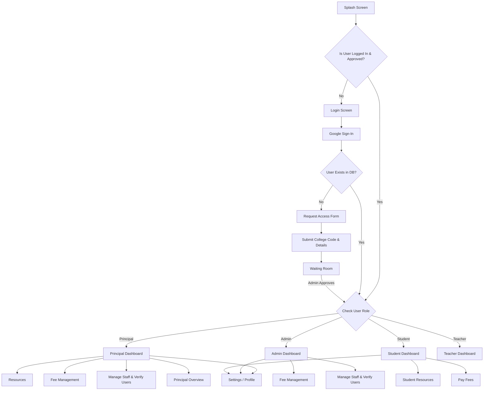
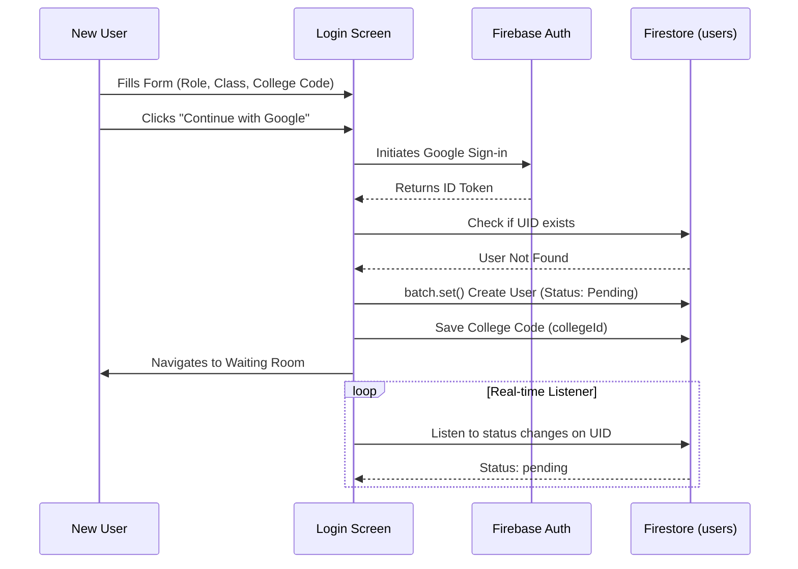
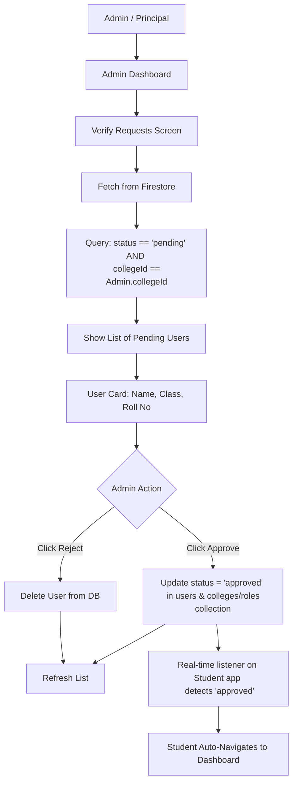
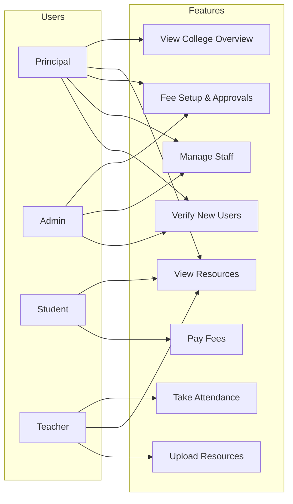

# CampusSync Architecture & Flowcharts

Below are detailed flowcharts mapping out the entire logic, architecture, and user journeys of the CampusSync app. 

## 1. Full App Navigation Flow
This chart shows the complete screen-to-screen navigation of the app, starting from the Splash screen to the various role-based dashboards.

---

## 2. Authentication & Multi-Tenancy Flow
This flowchart details the backend process of how a new user requests access to a specific college, and how the app handles multi-tenancy.

---

## 3. Admin Verification & Approval Flow
This chart shows how an Admin logs in and approves users specifically for their own college.

---

## 4. Role-Based Feature Access
A breakdown of which features are accessible by which user roles based on the current architecture.

